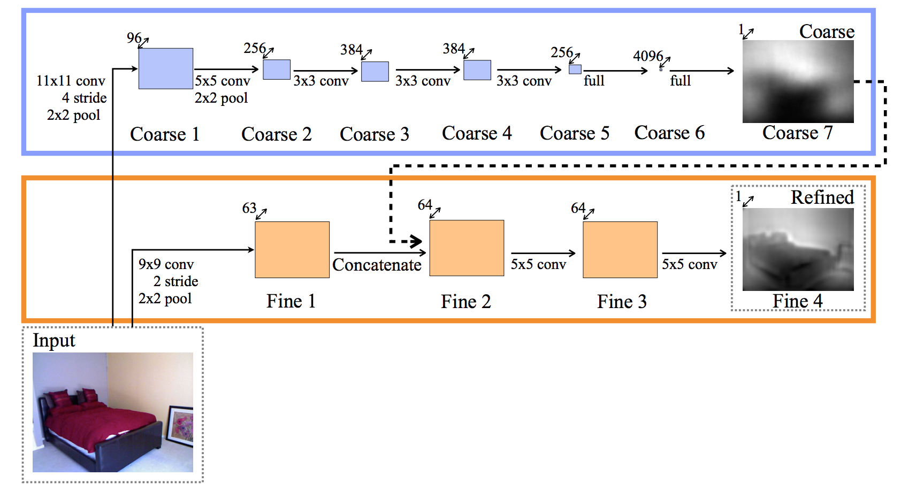

# cnn_depth_tensorflow
cnn_depth_tensorflow is an implementation of depth estimation using tensorflow.

Original paper is "Depth Map Prediction from a Single Image using a Multi-Scale Deep Network".
https://arxiv.org/abs/1406.2283



# requierments
- TensorFlow 0.10+
- Numpy

# How to train
- Download training data. Please see readme.md in data directory.
- Convert mat to png images.
```
python convert_mat_to_img.py
```

- Lets's train.
```
python task.py
```

- You can see predicting images through training in data directory.

# example
- input  

- output  


---

Copyright (c) 2016 Masahiro Imai
Released under the MIT license
